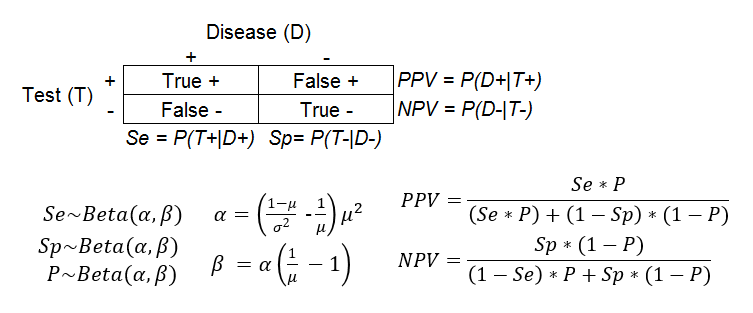
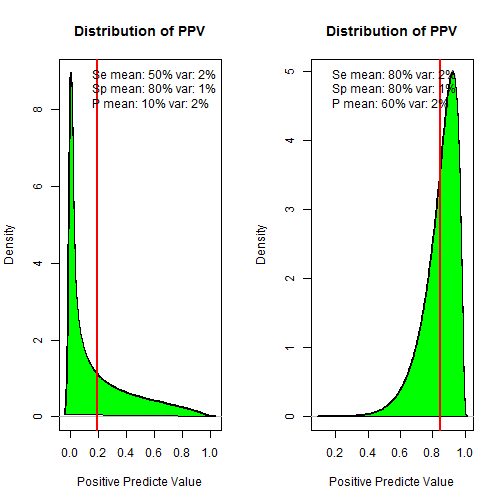

Develop Data Products - Project - Visual Aid for Diagnostic Test Interpretation
========================================================
author: Luis Espejo
date: 09/26/2015

Introduction and Background Information
========================================================
Diagnostic tests are never perfect. We use sensitivity and specificity to measure how imperfect they are. 

**Sensitivity** (Se) is the conditional probability that an individual tests positive (T+) given that is infected or has the disease is present (D+).  Se = P(T+ | D+)

**Specificity** (Sp) is the conditional probability that an individual tests negative (T-) given that is not infected or does not have the disease (D-). Sp = P(T-| D-)
The reverse conditional probabilities of the Se and Sp are the Predictive Values. Thus predictive values measure how likely an individual is infected given the prevalence and test results. 

**Positive and Negative Predictive Values** (PPV and NPV, respectively) are the probability of infected given the test results. PPV = P(D+|P+) and NPV = P(D-|T- )

**Prevalence** (P) is the proportion of the population that is infected. P = P(D+)

Objetive and Math
========================================================
The objective of this application was to improve the understanding of the diagnostic tests by showing the expected value and the distribution associated. Visual evaluation of the distribution of the Se and Sp aids to the understanding of the risk of implementing an specific diagnostic test. Similarly, understand the association between Se, Sp, P, NPV and PPV help patients to make informed decisions about their health.

Se, Sp and P were modeled using Beta distribution that help to visualize not only the expected value but also the uncertainty of the estimations.

App Example
========================================================

In this example, when we held the Sp constant at 80%, we see that individuals with a positive test results (T+) are less likely (~20%) to be infected, if the Se and P are low (50% and 10%, respectively). In contrast individuals with a positive test results are more likely to be infected (~85%), if the Se and P are higher (80% and 60%, respectively).

Final Comments
========================================================
* I think there is a lot of room to improve the application and this presentation, however my main objective was to accomplish the course project. 

* I think people (and physicians) need to better understand diagnostic tests and the meaning of their results.

* I invite you to play with the application. Understand the effect of different parameters values on the mean (red line) and on the overall shape of the distribution. 

* Also make sure you use realistic means and variances. For example, a mean of 99% and a variance of >2% may result in an error. Beta distribution does not "behave" well at making predictions for their extreme values (0 and 100).  

* Please feel free to contact me if you have any question about this application (lespejos(at)google email).

* The application is available at https://lespejos.shinyapps.io/DDPpoject
